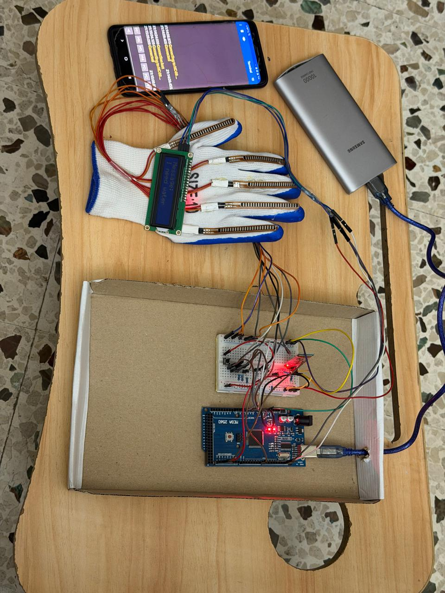

# Sign Glove

An Arduino-based wearable prototype that converts predefined hand gestures into text displayed on an LCD.

Developed as a Mini Project at the Lebanese University, Faculty of Engineering, Branch I.

## Overview

Five flex sensors measure finger bending. An Arduino Mega 2560 compares their readings against calibrated thresholds to identify one of 17 predefined gestures.

The recognized message appears on a 16×2 LCD. A Bluetooth module transmits sensor readings to a paired device.

## Features

- Recognition of 17 predefined gestures
- LCD output for messages such as “Hi”, “I need water”, and “Help!”
- Button-triggered capture with a three-second preparation countdown
- Automatic first capture at startup
- Bluetooth transmission of sensor readings
- Portable USB power-bank supply

## Hardware

- Arduino Mega 2560
- Five flex sensors
- HC-06 Bluetooth module
- 16×2 I2C LCD
- Push button
- Resistors, breadboard, and jumper wires
- Glove and USB power bank

## Software

- Arduino C/C++
- Wire and LiquidCrystal_I2C libraries
- Threshold-based gesture recognition
- Serial communication at 9600 baud

## How It Works

1. The user presses the button to start a capture.
2. A three-second countdown allows time to hold the gesture.
3. The Arduino reads the five flex sensors.
4. The readings are compared with predefined gesture ranges.
5. The corresponding message remains on the LCD until the next capture.

## Limitations

- Supports a fixed set of gestures rather than full sign-language translation.
- Sensor thresholds require calibration for the wearer and sensor placement.
- The supplied firmware sends sensor values over serial/Bluetooth; recognized messages are displayed on the LCD.
- The breadboard-based prototype requires further mechanical refinement for everyday wear.

## Getting Started

1. Download `sign_glove.ino` and place it inside a folder named `sign_glove`.
2. Open the sketch in the Arduino IDE.
3. Install a compatible `LiquidCrystal_I2C` library supporting `lcd.init()`. The sketch also uses `Wire`.
4. Select **Arduino Mega or Mega 2560** and the board's port.
5. Check the connections:
   - Flex sensor voltage-divider outputs: **A0–A4**
   - Push button: **D7 and GND**, using `INPUT_PULLUP`
   - I2C LCD: **SDA 20, SCL 21**, with address **0x27**
6. Upload the sketch.
7. Open the Serial Monitor at **9600 baud** to inspect sensor readings.
8. Adjust the gesture thresholds for your sensors and hand position.

The first capture starts automatically. Press the button for another capture, hold the gesture during the countdown, and read the resulting message on the LCD.

### Calibration

The sketch compares raw analog readings directly against fixed thresholds. Recalibrate these thresholds if the sensors, wiring, or wearer change. An unmatched gesture displays `?`.
